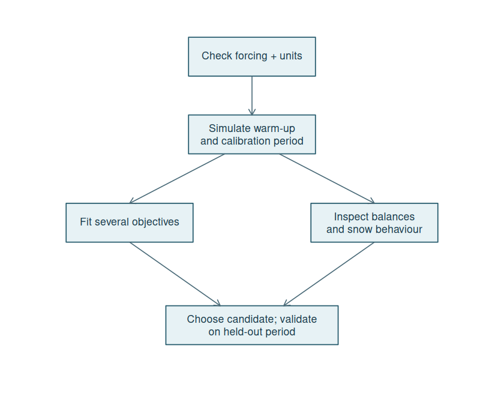
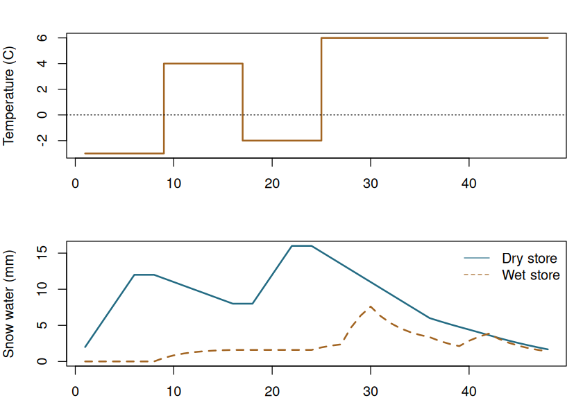
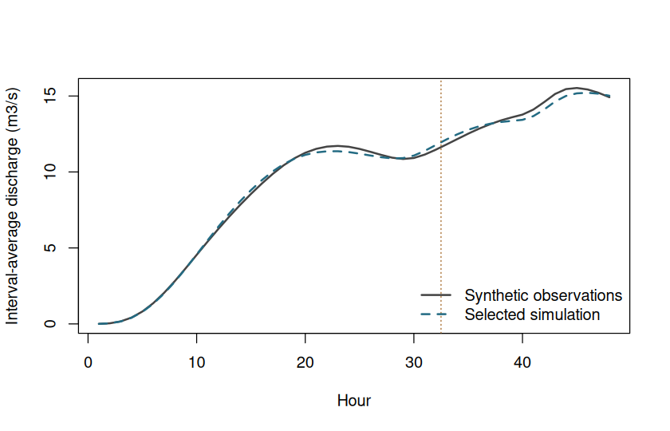

# Worked example: snow, flow, calibration and restart


# What this example demonstrates

This is a complete, reproducible **synthetic** example: 48 hourly intervals with
snow accumulation, thaw and rain. It needs no downloads. We create synthetic
observations, fit two parameters using only the first 32 hours, then evaluate
the remaining 16 hours without resetting the stores. The tiny calibration
budget keeps the vignette quick; it is not a recommended operational budget.



# 1. Construct and check the forcing


``` r
hour <- seq_len(48)
forcing <- data.frame(
  time = seq(as.POSIXct("2020-01-01 01:00:00", tz = "UTC"),
    by = "hour", length.out = 48
  ),
  rain = rep(0, 48),
  pet = rep(0.02, 48),
  temperature_c = c(rep(-3, 8), rep(4, 8), rep(-2, 8), rep(6, 24))
)
forcing$rain[c(1:6, 19:22)] <- 2
forcing$rain[c(28:30, 40:42)] <- 3
stopifnot(
  !anyNA(forcing), all(forcing$rain >= 0), all(forcing$pet >= 0),
  all(as.numeric(diff(forcing$time), units = "hours") == 1)
)
head(forcing)
#>                  time rain  pet temperature_c
#> 1 2020-01-01 01:00:00    2 0.02            -3
#> 2 2020-01-01 02:00:00    2 0.02            -3
#> 3 2020-01-01 03:00:00    2 0.02            -3
#> 4 2020-01-01 04:00:00    2 0.02            -3
#> 5 2020-01-01 05:00:00    2 0.02            -3
#> 6 2020-01-01 06:00:00    2 0.02            -3
```

Here `rain` is **total precipitation**, including snowfall, in mm per interval.
Temperature is °C and PET is mm per interval. Timestamps label interval ends.
For real inputs, verify time zone, duplicates, gaps, measurement units and
alignment with gauged discharge. Do not silently replace missing forcing with
zero. The simulator rejects missing inputs; missing observations are excluded
from metric calculations.

# 2. Configure and simulate


``` r
config <- list(pdm = pdm_presets("standard"), snow = pack_presets())
config$pdm$area_km2 <- 44
config$pdm$fc <- 1 # keep precipitation correction in one place
run_model <- function(cfg, rows, state = NULL, warmup = 0L) {
  sim_snow_pdm(forcing$rain[rows], forcing$temperature_c[rows], forcing$pet[rows],
    params = cfg, timestep_min = 60L, datetime = forcing$time[rows],
    state = state, warmup_steps = warmup
  )
}
initial_run <- run_model(config, hour, warmup = 8L)
attr(initial_run, "water_balance")
#>     residual_mm max_abs_step_mm 
#>   -2.378306e-15    1.609823e-14
stopifnot(max(abs(initial_run$combined_balance_error_mm)) < 1e-8)
```

The model starts with empty snow stores and PDM's default half-full soil.
The first eight rows remain in the result with `is_warmup=TRUE`. They are not
deleted, and warm-up flags alone do not establish state convergence. Real
catchments generally need a longer, representative warm-up assessment.



# 3. Create synthetic observations and reserve a validation period

For teaching purposes only, generate a reference hydrograph with a different
melt factor, then add a small deterministic multiplicative perturbation.
These values are **not field observations** and cannot establish model skill.


``` r
reference_config <- config
reference_config$snow$melt_factor_mmh_c <- 0.23
reference <- run_model(reference_config, hour)
observed_cms <- reference$qsim_cms * (1 + 0.03 * sin(hour / 3))
train <- 1:32
validate <- 33:48
```

# 4. Fit more than one objective

We minimize RMSE and absolute relative volume bias:

$$L_{\mathrm{RMSE}}=\sqrt{\frac{1}{n}\sum_i(Q_i-O_i)^2},\qquad
L_{\mathrm{bias}}=\left|\frac{\sum_i Q_i}{\sum_i O_i}-1\right|.$$

With user-chosen scales $s_j$ and nonnegative weights $w_j$ summing to one,
each local search minimizes $J=\sum_j w_j L_j/s_j$. The scale of 0.1 below
means 10% volume bias contributes one scaled unit. These tolerances and bounds
are illustrative; specify defensible ones for the catchment before fitting.


``` r
fit <- calibrate_pdm_multi(
  config, forcing[train, ], observed_cms[train],
  lower = c(snow.melt_factor_mmh_c = 0.08, pdm.surface.k1 = 0.5),
  upper = c(snow.melt_factor_mmh_c = 0.35, pdm.surface.k1 = 4),
  objectives = c("rmse", "abs_bias"),
  scales = c(rmse = 1, abs_bias = 0.1),
  weights = rbind(c(rmse = 1, abs_bias = 0), c(rmse = 0.5, abs_bias = 0.5)),
  n_samples = 3L, starts = 1L, seed = 42L, warmup = 8L,
  control = list(maxit = 3)
)
fit$pareto[, c(
  "snow.melt_factor_mmh_c", "pdm.surface.k1",
  "loss_rmse", "loss_abs_bias"
), with = FALSE]
#>    snow.melt_factor_mmh_c pdm.surface.k1 loss_rmse loss_abs_bias
#>                     <num>          <num>     <num>         <num>
#> 1:              0.2286652       1.977475 0.2092782  6.365200e-04
#> 2:              0.2289352       1.980975 0.2092114  7.456458e-04
#> 3:              0.2290269       2.004397 0.2087808  7.460150e-04
#> 4:              0.2292969       2.007897 0.2087209  8.551708e-04
#> 5:              0.2304737       2.112084 0.2069088  1.188830e-03
#> 6:              0.2307437       2.115584 0.2068828  1.299277e-03
#> 7:              0.2400500       3.470852 0.1914300  3.675045e-03
#> 8:              0.2270754       1.963278 0.2097238  1.658277e-05
#> 9:              0.2273454       1.966778 0.2096086  9.251524e-05
vapply(fit$optimization, function(x) x$convergence, integer(1))
#> [1] 1 1
```

A nonzero convergence code needs inspection; this deliberately short example
may stop at the iteration limit. `fit$archive` retains valid evaluated candidates,
and `fit$configs` aligns with rows of `fit$pareto`. The reported compromise uses
the **last weight row**, not the held-out observations. The Pareto front is only
the nondominated set among evaluated candidates; it is not a global-optimum
claim or a probability distribution. Weighted searches may miss nonconvex
trade-offs. Use more starts, larger budgets and repeated seeds for real studies.

Other available losses are `log_rmse`, `nse_loss`, `kge_loss` and
`peak_relative_error`. The last compares window maxima, not peak timing or
individual events. NSE/KGE need variable observations. Prefer fewer, identifiable
parameters over fitting every available coefficient to a short record.

# 5. Restart into validation without reinitialising


``` r
chosen <- fit$compromise$config
training_run <- run_model(chosen, train, warmup = 8L)
checkpoint <- attr(training_run, "final_state")
validation_run <- run_model(chosen, validate, state = checkpoint)
full_run <- run_model(chosen, hour)
stopifnot(isTRUE(all.equal(validation_run$qsim_cms, full_run$qsim_cms[validate])))
scores <- rbind(
  training = pdm_objectives(training_run$qsim_cms, observed_cms[train],
    c("rmse", "log_rmse", "nse_loss", "abs_bias"),
    warmup = 8L
  ),
  validation = pdm_objectives(
    validation_run$qsim_cms, observed_cms[validate],
    c("rmse", "log_rmse", "nse_loss", "abs_bias")
  )
)
scores
#>                 rmse   log_rmse    nse_loss     abs_bias
#> training   0.2097238 0.02064797 0.007428045 1.658277e-05
#> validation 0.3103225 0.02215528 0.065685090 8.887364e-03
attr(validation_run, "water_balance")
#>     residual_mm max_abs_step_mm 
#>    7.827072e-15    8.215650e-15
```

`nse_loss` is $1-\mathrm{NSE}$, so smaller is better; it is not NSE itself.
The validation record here is tiny and synthetic. Real acceptance should include
independent seasons, snow events, low flows, peak timing and water balance.
Do not repeatedly choose candidates against the same held-out period and still
call that period independent validation.



# 6. Save the complete restart context


``` r
checkpoint_path <- tempfile(fileext = ".rds")
saveRDS(list(
  package_version = as.character(packageVersion("pdmS7")),
  config = chosen, timestep_min = 60L,
  last_time = tail(forcing$time[train], 1), state = checkpoint
), checkpoint_path)
restored <- readRDS(checkpoint_path)
stopifnot(isTRUE(all.equal(restored$state, checkpoint)))
resumed <- run_model(restored$config, validate, state = restored$state)
stopifnot(isTRUE(all.equal(resumed$qsim_cms, validation_run$qsim_cms)))
unlink(checkpoint_path)
```

For a real run, use a caller-managed persistent path. Check the recorded version,
configuration, timestep and last timestamp before reuse: this saved list is an
example convention, **not an automated compatibility validator**. Both snow cover
history and PDM delay queues must be preserved. Never reset to empty snow halfway
through a thaw or change a model's structure while reusing its state.

# Before pseudo-operational use

- Confirm the image preset's assumed hourly units and snow-cover event conventions.
- Replace synthetic data with checked forcing and correctly aligned observations.
- Assess warm-up, parameter identifiability and timestep sensitivity.
- Review convergence, rejected evaluations and each objective separately.
- Obtain independent technical/scientific review and responsible maintainer sign-off.

River-network routing and additional state assimilation remain future avenues;
this workflow does not implement them. See the PDM and PACK companion vignettes
for equations and component functions, and `docs/roadmap.md` for deferred work.
