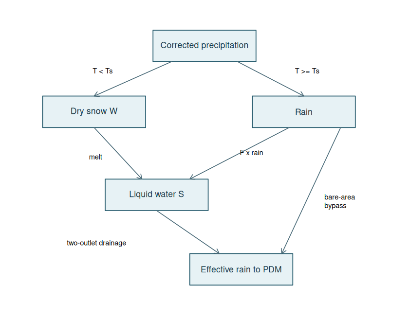
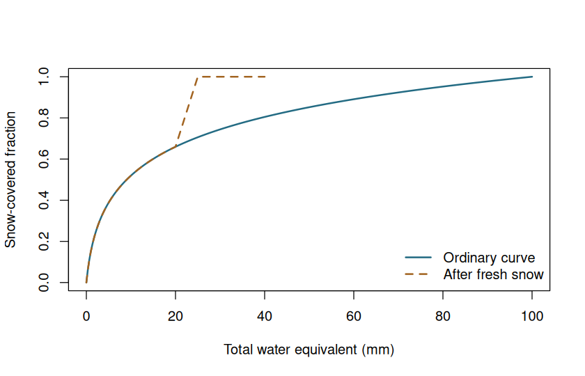

# PACK explained: storing snow and releasing meltwater


# Why snow needs its own stores

Snowfall does not immediately behave like rainfall. It can accumulate for days,
melt later and briefly retain liquid water before draining. PACK represents this
with a **dry store** $W$ (ice/snow expressed as water equivalent) and a **wet store**
$S$ (liquid water inside the pack). A temperature rule partitions rain and snow;
a second temperature rule controls melt. The model passes drainage and rain on
bare ground to PDM as effective rainfall.



Water equivalent is the depth of water obtained by melting the snow. **10 mm of
water equivalent is not 10 mm of snow depth.** Stores and fluxes are averaged
over the catchment area, rather than being local depths over snow-covered patches.

# The nine image parameters, plus implementation controls

`pack_presets()` defaults to the supplied parameter-file image, not the adjacent
typical-values table. The image omits time units. **Hourly rate units are assumed,
not verified**, and must be confirmed before operational use. In particular, the
wet-store coefficients are used directly as inverse-hour rates; there is no
undocumented exponential conversion.

| Argument | Meaning | Image default | Unit |
|---|---|---:|---|
| `precipitation_factor` | Multiplier for measured precipitation | 1 | dimensionless |
| `lower_rate_h` | Slow wet-store drainage coefficient $k_1$ | 0.00677 | h⁻¹, assumed |
| `upper_rate_h` | Additional drainage coefficient $k_2$ | 0.27095 | h⁻¹, assumed |
| `retention_fraction` | Liquid fraction setting the upper outlet level $r$ | 0.04 | fraction |
| `melt_factor_mmh_c` | Melt per degree above threshold, $f$ | 0.16667 | mm/h/°C, assumed |
| `adc_alpha` | Final fraction of a fresh-snow excursion over which cover reverts | 0.25 | fraction |
| `adc_depth_mm` | Water content for complete cover, $\theta_c$ | 100 | mm |
| `melt_threshold_c` | Melt threshold $T_m$ | 1 | °C |
| `snow_threshold_c` | Rain/snow threshold $T_s$ | 0 | °C |
| `drain_threshold_c` | Below this, drainage stops | 0 | °C; from report |
| `areal_depletion` | Allow partial snow cover | TRUE | logical |
| `max_step_min` | Largest internal accounting interval | 60 | minutes |

The separate `report_daily` preset converts the report's typical $k_1=0.15$/day,
$k_2=0.85$/day and $f=4$ mm/day/°C to hours, and uses $T_m=0$, $T_s=1$ °C.
Those differences are real preset differences, not rounding errors.


``` r
pack_presets("image_hourly")
#> $precipitation_factor
#> [1] 1
#> 
#> $lower_rate_h
#> [1] 0.00677
#> 
#> $upper_rate_h
#> [1] 0.27095
#> 
#> $retention_fraction
#> [1] 0.04
#> 
#> $melt_factor_mmh_c
#> [1] 0.16667
#> 
#> $adc_alpha
#> [1] 0.25
#> 
#> $adc_depth_mm
#> [1] 100
#> 
#> $melt_threshold_c
#> [1] 1
#> 
#> $snow_threshold_c
#> [1] 0
#> 
#> $drain_threshold_c
#> [1] 0
#> 
#> $areal_depletion
#> [1] TRUE
#> 
#> $max_step_min
#> [1] 60
pack_presets("report_daily")[c(
  "lower_rate_h", "upper_rate_h",
  "melt_threshold_c", "snow_threshold_c"
)]
#> $lower_rate_h
#> [1] 0.00625
#> 
#> $upper_rate_h
#> [1] 0.03541667
#> 
#> $melt_threshold_c
#> [1] 0
#> 
#> $snow_threshold_c
#> [1] 1
```

# One step, in equations and words

Let $p$ be corrected precipitation depth during one **internal** step of length
$h$ hours. Let $T$ be its constant temperature, and $F$ the fraction covered by snow.
The precipitation multiplier is applied before partitioning.

## 1. Rain or snow?

$$p_{\mathrm{snow}}=\begin{cases}p,&T<T_s\\0,&T\geq T_s\end{cases},
\qquad p_{\mathrm{rain}}=p-p_{\mathrm{snow}}.$$

At the snow threshold itself, precipitation is rain. New snow enters $W$ and
restores full cover for that step.

## 2. How much melts?

$$m=\min\left(W+p_{\mathrm{snow}},\;F f\max(0,T-T_m)h\right),$$
$$W_{\mathrm{new}}=W+p_{\mathrm{snow}}-m.$$

Temperature above the melt threshold supplies the melt demand. The area factor
scales local melt potential to a catchment average, and the minimum prevents
melting snow that is not there. At $T=T_m$, melt is zero.

## 3. Fill the wet store and release drainage

Rain on covered area and newly melted water enter the wet store:

$$S'=S+F p_{\mathrm{rain}}+m,\qquad S_c=r(S'+W_{\mathrm{new}}).$$

The lower outlet always drains slowly when drainage is permitted. The upper
outlet adds drainage only above its moving threshold:

$$D=\begin{cases}
0,&T<T_c,\\
\min\{S',\;h[k_1S'+k_2\max(S'-S_c,0)]\},&T\geq T_c.
\end{cases}$$

$$S_{\mathrm{new}}=S'-D,\qquad
p_{\mathrm{effective}}=D+(1-F)p_{\mathrm{rain}}.$$

The second term is rain on bare ground; it bypasses the pack. Cold weather
inhibits drainage, but does **not** turn stored liquid water back into ice in
this implementation. Retention is a moving outlet threshold, not a rule that
stops all drainage below it: the lower outlet can still drain.

## A hand-checkable example

Take 10 mm of dry snow, full cover, 2 mm of rain, $T=3$, $T_m=1$, $f=1$,
$k_1=0.1$, $k_2=0.2$, $r=0.04$ and $h=1$. Melt is 2 mm; dry storage becomes
8 mm; provisional wet storage is 4 mm. The threshold is $0.04(4+8)=0.48$ mm,
and drainage is $0.1(4)+0.2(4-0.48)=1.104$ mm. Final wet storage is 2.896 mm.


``` r
model <- FlodePackModel(
  melt_factor_mmh_c = 1, lower_rate_h = 0.1,
  upper_rate_h = 0.2, retention_fraction = 0.04, areal_depletion = FALSE
)
step <- pack_step(model, FlodePackState(dry_mm = 10),
  precipitation_mm = 2, temperature_c = 3, dt = 1
)
step$flux[c("melt_mm", "drainage_mm", "dry_snow_mm", "wet_snow_mm")]
#>     melt_mm drainage_mm dry_snow_mm wet_snow_mm 
#>       2.000       1.104       8.000       2.896
stopifnot(abs(step$flux[["drainage_mm"]] - 1.104) < 1e-12)
```

# Partial cover and fresh-snow memory

A shallow pack need not cover the whole catchment. With total water content
$\theta=W+S$, the ordinary areal depletion curve is

$$F_0(\theta)=\min\left(1,\frac{\log(1+\theta)}{\log(1+\theta_c)}\right).$$

Depths inside this empirical expression are numeric values in **millimetres**.
Fresh snow temporarily restores cover to one. The state records the previous
water content $\theta_a$, previous cover $F_a$ and fresh-snow excursion $N$.
For $N>0$ and $\theta>\theta_a$ the implemented return path is

$$F(\theta)=\max\left[F_0(\theta),\;
F_a+(1-F_a)\min\left(1,\frac{\theta-\theta_a}{\alpha N}\right)\right].$$

Below the anchor, return to $F_0$. The empty pack has zero cover. With areal
depletion disabled, any nonempty pack has full cover.



**Important implementation interpretation:** the report gives prose and a
diagram, not complete event logic. Here depletion means a fall in **total pack
water content**, following Figure 2.2's axis. Melt transferring water from $W$
to $S$ alone does not reduce that total. Consecutive undepleted snowfall grows
one excursion; snowfall during depletion starts a new anchor. These choices,
and catchment-area scaling of melt, require independent scientific review.

# Substeps, conservation and coupling

`pack_step()` divides an interval into

$$N_{\mathrm{sub}}=\left\lceil\max\left(
\frac{60\Delta t}{\text{max\_step\_min}},\;
\Delta t(k_1+k_2),\;1\right)\right\rceil.$$

This keeps the explicit drainage step stable; forcing is uniform within the
interval. It is not an exact continuous-time solution. Shorter internal steps
can change results, so test sensitivity. The snow-only residual is

$$\epsilon_{\mathrm{snow}}=(W+S)_{\mathrm{old}}+p_{\mathrm{corrected}}
-p_{\mathrm{effective}}-(W+S)_{\mathrm{new}}.$$

When coupled, PDM's `fc` still multiplies the effective rain. Usually set it to
one to avoid two precipitation corrections. If not, `pdm_correction_mm` records
the additional input adjustment. The combined residual includes both stores
and that adjustment; it excludes the external PDM outlet term `qc`.

| Task | Function / object |
|---|---|
| Choose and edit parameters | `pack_presets()`, `pack_from_config()`, `FlodePackModel()` |
| Set initial dry, wet and cover-history state | `FlodePackState()` |
| Inspect one accounting step | `pack_step()` |
| Run snow without PDM | `sim_pack()` |
| Run snow and PDM together | `sim_snow_pdm()` |


``` r
snow <- sim_pack(c(10, 5, 0, 0), c(-2, -1, 3, 6))
snow[, c("dry_snow_mm", "wet_snow_mm", "effective_rain_mm"), with = FALSE]
#>    dry_snow_mm wet_snow_mm effective_rain_mm
#>          <num>       <num>             <num>
#> 1:    10.00000   0.0000000       0.000000000
#> 2:    15.00000   0.0000000       0.000000000
#> 3:    14.66666   0.3310833       0.002256712
#> 4:    13.83331   1.0035924       0.160840871
attr(snow, "water_balance")
#> [1] -7.719519e-16
```

For restart, keep the **whole** `final_state`: dry and wet depths alone do not
preserve the fresh-snow cover history. Coupled output contains a list with both
`snow` and `pdm` states. PET passes unchanged to PDM; no snow-specific evaporation
or sublimation process is implied. Refreezing, cold content, elevation bands,
wind effects and PACK survey assimilation are not implemented.

## Source and status

Institute of Hydrology, *PACK: A Pragmatic Snowmelt Model for Real-time Use*,
[NORA report 15304](https://nora.nerc.ac.uk/id/eprint/15304/1/N015304CR.pdf),
equations 2.1–2.8, Figure 2.2 and Table 2.1. The implementation is independent;
agreement with an IMFS/RFFS executable has not been established. Engineering
tests do not replace parameter-unit confirmation or catchment validation.
